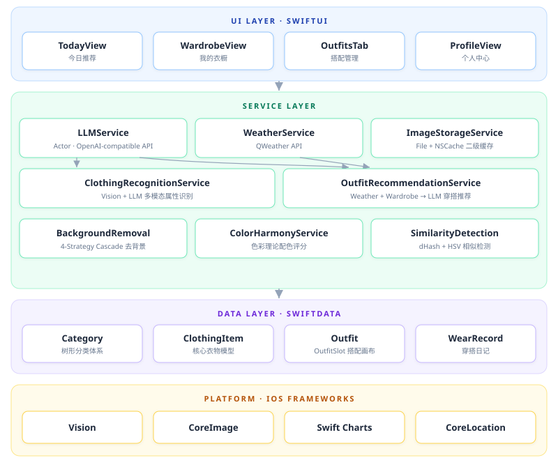

<div align="center">

# SmartWardrobe

### AI-Powered Smart Wardrobe for iOS

An intelligent clothing management app built with SwiftUI + SwiftData + Vision + LLM

用 AI 重新定义你的衣橱管理方式

[](https://swift.org)
[](https://developer.apple.com/ios/)
[](https://developer.apple.com/xcode/swiftui/)
[](https://developer.apple.com/xcode/swiftdata/)
[](LICENSE)

[功能特性](#-功能特性) · [截图预览](#-截图预览) · [快速开始](#-快速开始) · [隐私说明](#-隐私说明) · [技术架构](#-技术架构) · [参与贡献](#-参与贡献)

</div>

---

## 简介

**SmartWardrobe（智能衣橱）** 是一款 iOS 原生智能衣物管理应用。通过 AI 视觉识别自动录入衣物属性，利用大语言模型结合天气数据提供个性化穿搭推荐，帮助你高效管理衣橱、发现更多搭配可能。

> 从拍照录入 → 智能识别 → 搭配推荐 → 穿搭记录，覆盖衣物管理的完整生命周期。

## 🌟 功能特性

### 衣物管理
- **多方式录入** — 拍照、相册批量导入、淘宝链接一键导入
- **AI 自动识别** — 拍照后自动识别分类、颜色、材质、领型、袖长等属性（LLM 多模态视觉）
- **智能去背景** — 基于 Vision 框架的 4 策略级联去背景（前景实例分割 → 人像分割 → 显著性检测 → 颜色泛洪），自动裁剪
- **本地颜色提取** — CIELAB 色彩空间 + K-means 聚类，精准识别衣物主色调
- **丰富的属性体系** — 9 大分类 + 细分子类、26 种预设颜色、材质/领型/袖长/闭合方式等多维度标签
- **相似衣物检测** — dHash 指纹 + HSV 直方图，避免重复录入

### 穿搭推荐
- **今日推荐** — 结合实时天气、季节、场合偏好和穿着历史，LLM 生成 3 套搭配方案
- **单品搭配** — 选中一件衣物，AI 推荐最佳搭配组合，附配色和谐度评分
- **色彩和谐分析** — 基于色彩理论的配色评分（互补色、邻近色、同色系等）

### 穿搭日历
- **每日穿搭打卡** — 记录每天穿了什么，支持心情和场合标记
- **穿着频次统计** — 可视化每件衣物的穿着频率，发现衣橱中的"沉睡单品"

### 搭配画布
- **自由画布** — 拖拽、缩放、旋转衣物，DIY 搭配方案
- **多种背景风格** — 浅色/深色多种画布背景可选
- **一键保存** — 自动生成搭配缩略图

### 数据与统计
- **衣橱概览** — 分类数量、颜色分布、季节分布等数据统计
- **性价比排行** — 基于穿着次数和购买价格计算每次穿着成本（CPW）
- **闲置提醒** — 智能提醒长期未穿的衣物
- **数据导入导出** — ZIP 格式完整备份与恢复

## 📱 截图预览

<div align="center">
<table>
  <tr>
    <td align="center"><b>衣橱分类浏览</b></td>
    <td align="center"><b>衣物详情</b></td>
    <td align="center"><b>属性编辑</b></td>
    <td align="center"><b>DIY 搭配画布</b></td>
  </tr>
  <tr>
    <td></td>
    <td></td>
    <td></td>
    <td></td>
  </tr>
</table>
</div>

## 🚀 快速开始

### 环境要求

| 要求 | 最低版本 |
|---|---|
| Xcode | 16.0 |
| iOS | 17.0 |
| Swift | 5.9 |
| macOS | Sonoma 14.0（用于开发）|

### 安装与运行

```bash
# 1. 克隆仓库
git clone https://github.com/yimeixiaobai/smart_wardrobe.git
cd smart_wardrobe

# 2. 安装 XcodeGen（如未安装）
brew install xcodegen

# 3. 生成 Xcode 项目
xcodegen generate

# 4. 打开项目
open SmartWardrobe.xcodeproj
```

在 Xcode 中选择目标设备后，点击 Run 即可。

### 配置 AI 服务（可选）

应用的核心功能（衣物管理、搭配画布等）**无需任何配置即可使用**。如需启用 AI 智能推荐，在应用的「我的 → AI 设置」中配置：

| 服务 | 用途 | 说明 |
|---|---|---|
| **LLM API** | 衣物属性识别、穿搭推荐 | 任何兼容 OpenAI Chat API 的服务均可（需支持 Vision） |
| **和风天气 API** | 获取天气数据 | 免费注册 [QWeather](https://dev.qweather.com/) 获取 Key |

## 🔐 隐私说明

SmartWardrobe 没有内置后台服务，也不会内置上传你的衣橱数据。衣物图片、穿搭记录、API Key 等数据默认保存在本机；其中 API Key 使用 Keychain 保存。

启用 AI 识别、穿搭推荐、天气、淘宝导入等功能时，应用会根据你的操作向你配置的第三方服务发送必要数据。详细说明见 [隐私说明](PRIVACY.md)。

## 🏗 技术架构

<div align="center">
  
</div>

### 核心技术亮点

- **纯 SwiftUI + SwiftData** — 无 UIKit 桥接，全声明式 UI，iOS 17 原生数据持久化
- **4 策略级联去背景** — VNGenerateForegroundInstanceMaskRequest → 人像分割 → 显著性检测 → 安全颜色泛洪，逐级降级确保成功率
- **CIELAB 色彩空间** — 在感知均匀的色彩空间中做 K-means 聚类 + Farthest-First 初始化，比 RGB 空间更符合人眼感知
- **LLM 全流程集成** — 衣物识别（Vision Chat）、穿搭推荐（结构化 prompt + JSON 解析）、天气感知搭配
- **Actor 并发安全** — 核心服务（LLMService、BackgroundRemovalService、ClothingRecognitionService）均使用 Swift Actor 保证线程安全
- **磁盘 + 内存二级缓存** — 图片存文件系统、文件名存 SwiftData、NSCache 内存缓存，兼顾性能与存储效率

## 📂 项目结构

```
SmartWardrobe/
├── Models/              # SwiftData 数据模型
├── Services/            # 业务逻辑层（AI 识别、推荐、图片处理等）
├── Views/
│   ├── Today/           # 今日推荐 + 天气 + 打卡
│   ├── Wardrobe/        # 衣橱浏览
│   ├── Outfit/          # 搭配画布 + 搭配列表
│   ├── Calendar/        # 穿搭日历
│   ├── Camera/          # 拍照 / 批量导入 / 淘宝导入
│   ├── Detail/          # 衣物详情 + 编辑
│   ├── Recommendation/  # AI 推荐页
│   ├── Profile/         # 个人中心 + 统计
│   ├── Settings/        # API 配置
│   └── Components/      # 通用 UI 组件
├── Utilities/           # 扩展 + 常量
└── Resources/           # Assets + 默认分类数据
```

## 🤝 参与贡献

欢迎任何形式的贡献！

1. Fork 本仓库
2. 创建你的功能分支 (`git checkout -b feature/amazing-feature`)
3. 提交更改 (`git commit -m 'Add some amazing feature'`)
4. 推送到分支 (`git push origin feature/amazing-feature`)
5. 创建 Pull Request

### 本地开发

```bash
# 生成项目（修改 project.yml 后必须执行）
xcodegen generate

# 查看本机可用模拟器
xcrun simctl list devices available

# 构建
xcodebuild -scheme SmartWardrobe -destination 'platform=iOS Simulator,name=<你的模拟器名称>' build

# 运行测试
xcodebuild -scheme SmartWardrobe -destination 'platform=iOS Simulator,name=<你的模拟器名称>' test
```

## 📄 License

本项目采用 [Apache License 2.0](LICENSE) 开源协议。

---

<div align="center">

**如果这个项目对你有帮助，请点个 Star 支持一下！**

Made with SwiftUI

</div>
